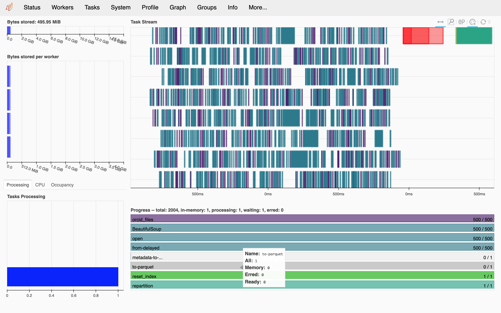
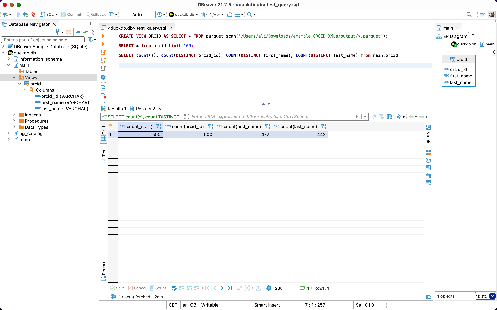

# Parallelized and out of memory data analysis using Dask in Python and DuckDB and DBeaver in SQL
## Using example of publicly accessible ORCID 2019 XML files

## Outline

I am going to briefly go over these topics:

0. Why do we need to learn about parallelization and out of memory computation?
1. (if you are convinced), Required installation and set-up 
2. Data preparation using Dask in Python
3. Further processing and analyzing data with SQL, using DuckDB and DBeaver

### -1. Video recording of the tutorial

A video recording of the tutorial is publicly available here on YouTube: [https://youtu.be/pYDVrBcIuYI](https://youtu.be/pYDVrBcIuYI)


### 0. Why do we need to learn more about parallelization and out of memory computation?

First thing that might come to mind is "*why do I need to bother with out of memory computing and parallelization when there is so much RAM available these days?*"

My answer would be with the increase in size of data (e.g., big data) and also embarrassingly repetitive tasks that are independent from each other, it is pretty necessary to learn how to do things in parallel. Because processing multiple data files simultaneously simply saves a lot of time. Hence, spending some time learning about parallelization would pay back and also it would help handling data that does not fit into machine's memory by analyzing it in chunks and in parallel.

In late 2018, I needed to process thousands of files and while they were separate from each other, I did not know how to do that in parallel. My go to method (e.g., in R or Python) was to write functions that process the data, then feed them to a for loop and add error handling and exceptions and let it run for a while to finish processing those files. In late 2019, when I faced the same challenge, I searched more before using my previous approach and came across multiple solutions discussing parallelization. I can imagine that for those with computer science and programming background in graduate school, this is a pretty basic subject as they learn about it pretty early. For social scientists, this might not be thought at all. So, investing a couple of weeks and few months, I learned how to process multiple files simultaneously and in parallel. This saved me so much time. I will show an example below.

As a practical example, I am going to use ORCID 2019 researcher profiles that are publicly available here: [https://orcid.figshare.com/articles/dataset/ORCID_Public_Data_File_2019/9988322](https://orcid.figshare.com/articles/dataset/ORCID_Public_Data_File_2019/9988322) 

You can download the zipped file named "ORCID_2019_summaries.tar.gz", which is 10.76GB. Be patient for it to be unzipped since it includes one XML file per ORCID profile and will take a lot of time to unzip. Here I will show you only one folder with `500` XML files, but the same method and script below will allow you to process all of the 13 million profiles (you might need to do some error handling of course). 

### 1. Required installation and set-up for Python

The following software have installation files for Windows/Linux/Mac. Please choose the one suitable for your operating system and install them. None of them require administrator privileges to be installed, hence you can use your personal laptop or work PC to install them.

**NOTE**: If you have already followed steps outlined in `01_Required_installation_setup_python.md`, you can skip first steps (conda environment creation) and jump to step on DuckDB, i.e., `Download the DuckDB CLI from: https://duckdb.org/docs/installation/` below.

- Clone (download) this repository from GitHub: [https://github.com/akbaritabar/bibliometric_data_for_demographic_research](https://github.com/akbaritabar/bibliometric_data_for_demographic_research)
- Please install Anaconda Python from: https://www.anaconda.com/products/individual (**NOTE**: if you use other distributions of Python or environment management systems, it is OK, but make sure to install all libraries in yaml file and run the codes to see if they work?)
    - Use the "yml" file in this directory named "00_setup_required_environment.yml" and conda to create an environment with needed python libraries following points below
    - After successful installation of python, open "Anaconda prompt" (doesn't need to be administrator) by going to windows start menu and searching it
    - Uncomment the line suitable for your operating system in the "yml" file (line 8 for Unix users and line 6 for Windows users. Uncomment means, "delete the starting "#" sign in the line. If needed, change the directory in "yml" file based on where Anaconda Python is installed on your PC)).
    - NOTE: Please rename the environment from bibliodemography to something else (e.g., add a 1 or 2 digit number(s) to the end of the name in line 1 that reads name: bibliodemography to become name: bibliodemography23) if you think someone else might use the same computer to create this environment on the same computer (e.g., if you share a computing platform with colleagues).
    - Change directory to where you have downloaded the "yml" file (e.g., run `cd Users\YOUR-USERNAME\Downloads\` on Windows)
    - Run `conda env create -f 00_setup_required_environment.yml` (it will take a while to download and install the libraries, circa 5-15 minutes is normal depending on the system and internet speed)
    - Check if the installation has been successful and environment is usable (run `conda env list` which should show you "base" and the new environment "bibliodemography". Then run `conda activate bibliodemography` and it should add this name into parenthesis before your prompt e.g., "(bibliodemography) ..."
- You can open jupyter lab by opening the "Anaconda prompt" and run `jupyter lab`
- Now, the second code chunk in the code below (the part with import calls) should run without a problem
- Download the DuckDB CLI from: https://duckdb.org/docs/installation/
- Install DBeaver from: https://dbeaver.io/download/
- You can open Dbeaver and follow the instructions here to create a connection to DuckDB (https://github.com/dbeaver/dbeaver/wiki/Create-Connection) or you can wait for us to do it together in the session (if you wished to do it, see next point below for a heads-up)
- You need to establish a connection as DuckDB (DBeaver comes with the needed drivers, you need to create an empty .db (database) file, which you can do by downloading the CLI, calling e.g., duckdb.exe mydb.db for windows using CMD, or ./duckdb mydb.db on mac/linux terminal).

#### 1.1 If environment was messed up, what to do?
- First, calm down, it is OK, the goal of using environments was not to cause harm to other projects and isolate them (and also to ensure replicability of projects!)
- Activate `base` environment (with `conda activate base`), because we want to delete `bibliodemography` and recreate it.
- Remove conda environment `bibliodemography` with `conda remove --name bibliodemography --all`
- Then again install everything with: `conda env create -f 00_setup_required_environment.yml`
- Activate bibliodemography ("conda activate bibliodemography" and see with "conda info" if everything if fine?)


### 2. Data preparation using Dask in Python

[**Dask**](https://dask.org/) is a Python library that allows you to use familiar data structures like Pandas dataframe and Numpy array and process them in parallel. It can read files that do not fit into the memory. It is much faster if you use file formats that allow chunking (e.g., parquet which is a column based format, see more: [https://en.wikipedia.org/wiki/Apache_Parquet](https://en.wikipedia.org/wiki/Apache_Parquet)). In addition, Dask comes with a set of functionalities that are very much helpful to parse unstructured data (i.e., text) using [*bag*](https://docs.dask.org/en/latest/bag.html) or to parallelize custom Python code through using [*futures*](https://docs.dask.org/en/latest/futures.html) or [*delayed*](https://docs.dask.org/en/latest/delayed.html) actions.

This was [the book](https://www.google.de/books/edition/Data_Science_with_Python_and_Dask/KTkzEAAAQBAJ?hl=en&gbpv=0) that walked me step by step to understand how Dask works and adopt it to my own use-case. Of course videos and tutorials by the Dask team were helpful as well, see them in ([https://examples.dask.org/applications/embarrassingly-parallel.html](https://examples.dask.org/applications/embarrassingly-parallel.html) and make sure to see the best practices [https://docs.dask.org/en/stable/best-practices.html](https://docs.dask.org/en/stable/best-practices.html)).

Using above example, imagine having to parse millions of XML files, filter, and convert them into a tabular or structured form and export them into a file to analyse further. Here, each of those XML files are independent from each other and if you try to do them in a linear fashion, they will be processed in order, while you can process multiple of them simultaneously in parallel and at the end join the results to construct a big table or dataframe (or array if you wish).

#### Example of parsing 500 XML files using Dask delayed

Here I have taken only part of one XML file for a researcher named "Paul Bilsborrow" (see here: https://orcid.org/0000-0002-6840-9000). The part I have chosen to show includes the profile details such as ORCID id, first and last names and when the profile was created (2017) or updated:

```XML
    <person:person path="/0000-0002-6840-9000/person">
        <person:name visibility="public" path="0000-0002-6840-9000">
            <common:created-date>2017-10-10T09:04:00.232Z</common:created-date>
            <common:last-modified-date>2017-10-10T09:04:00.464Z</common:last-modified-date>
            <personal-details:given-names>Paul</personal-details:given-names>
            <personal-details:family-name>Bilsborrow</personal-details:family-name>
        </person:name>
        <other-name:other-names path="/0000-0002-6840-9000/other-names"/>
        <researcher-url:researcher-urls path="/0000-0002-6840-9000/researcher-urls"/>
        <email:emails path="/0000-0002-6840-9000/email"/>
        <address:addresses path="/0000-0002-6840-9000/address"/>
        <keyword:keywords path="/0000-0002-6840-9000/keywords"/>
        <external-identifier:external-identifiers path="/0000-0002-6840-9000/external-identifiers"/>
    </person:person>

```

All other `499` files have a section that includes these information. Below, I have written a brief Python script that takes the XML file, parses it with BeautifulSoup library, extracts 3 pieces of information (ORCID ID, last name, given name) and when it finishes with all these files, it exports the results as one table. **The most important thing here is that since my machine has 4 CPU cores, it assigns 2 threads per core and processes 8 files at a time instead of one**.


```python
# Reading all XML files in parallel, parsing and taking info we want
import dask.dataframe as dd
import pandas as pd
from bs4 import BeautifulSoup  # to read XML, you need to install "lxml" (use: "pip install lxml")
import time
import glob
import os
# using dask delayed to take my custom function below, but run it in parallel
from dask import delayed
from dask.distributed import Client, progress
# here you can define number of workers to be made for parallel processing (each worker will handle one file/process)
# like this: `client = Client(n_workers=100, threads_per_worker=1)`
# I am leaving it empty to have workers equal to the number of cores on my machine
client = Client()
# having a look at dask dashboard which shows progress of parallel tasks (see dask documentation on it and a photo below)
client

```


```python
# ============================
#### Parsing ORCID 2019 XML files ####
# ============================

# XMLs from: https://orcid.figshare.com/articles/dataset/ORCID_Public_Data_File_2019/9988322

# orcid XML files (you need to change to your download directory)
data_dir = os.path.join('..', '1_data','XML_files')
# results (create an outputs folder first)
res_dir = os.path.join('..', '98_outputs')

# ============================
#### function to take scholar's info ####
# ============================
# find all author first/last names and orcid IDs
def orcid_files(xml2use):
    try:
        aut_id = xml2use.find("common:path").text
    except AttributeError:
        aut_id = 'Problematic_ORCIDid'
    try:
        aut_fname = xml2use.find("personal-details:given-names").text
    except AttributeError:
        aut_fname = 'Problematic_fname'            
    try:
        aut_lname = xml2use.find("personal-details:family-name").text
    except AttributeError:
        aut_lname = 'Problematic_lname'            
    aut_dt = pd.DataFrame({"orcid_id":aut_id, "first_name": aut_fname, "last_name": aut_lname}, index=[0])
    return aut_dt

# ============================
#### Function with dask delay ####
# ============================
def load_parse_delayed(filedir):
    t1 = time.time()
    print('Time is now: ', t1)
    # lists all XML files in the sub-directories of data_dir
    files = sorted(glob.glob(os.path.join(filedir, '**', '*.xml'), recursive=True))
    output_dfs = []
    for file2use in files:
        # "delayed" tells dask what is the step to be done, but does not do it yet, dask scheduler manages these to be done in parallel
        data = delayed(open)(file2use, encoding="utf8")
        data_read = delayed(BeautifulSoup)(data, features="xml")
        data_normalized = delayed(orcid_files)(data_read)
        output_dfs.append(data_normalized)
    dask_dds = dd.from_delayed(output_dfs, meta=pd.DataFrame({"orcid_id":"", "first_name": "", "last_name": ""}, index=[0])).repartition(partition_size="100MB")
    dask_dds.to_parquet(path=os.path.join(res_dir),
                        engine='pyarrow', write_index=False)
    print('Dask data frame built and wrote to parquet!')
    t = time.time()-t1
    print("Process took this much minutes:", t/60)
    return None


# apply it
parse_files = load_parse_delayed(filedir=data_dir)

```

    Time is now:  1638045415.723347
    Dask data frame built and wrote to parquet!
    Process took this much minutes: 0.5291663845380147


As you can see from the above, it took my machine `52` seconds to finish reading those 500 files, parse and extract the needed information.


```python
# when you are finished, it is good practice to close your client with
client.close()
```

Here I am adding a screenshot of the Dask dashboard that is very useful in showing you the progress of tasks and finding out which steps could be bottlenecks of the process. Each row in the `task stream` tab (top right in the photo) shows one parallel process and different steps (e.g., reading the file, parsing it as XML, taking the information I need and exporting it).



### 3. Further processing and analysing data with SQL, using DuckDB and DBeaver

Now that we are finished pre-processing our XML files (of course parsing all of the ORCID snapshot will take longer depending on the machine you use and computing power), we can go ahead and use the data in our analysis. 

Dask is really powerful in analysis too and dask dataframe is very similar to Pandas and it can read files that do not fit into the memory. It is much faster if you use file formats that allow chunking (e.g., parquet which is a column based format, see more: [https://en.wikipedia.org/wiki/Apache_Parquet](https://en.wikipedia.org/wiki/Apache_Parquet)).

In my case, exported files usually are about 100GB (more or less) and in general querying them in Python, with or without Dask, takes long. I was introduced by a colleague (thanks Tom) to [DuckDB](https://duckdb.org/) which is amazingly fast in handling large data files and works extremely fast with parquet format.

It gives multiple interfaces (e.g., to connect and use it in Python, R or other languages) and I very much liked their command line interface that allows using `SQL` for your queries. This allows me (by keeping a coherent data structure and file/column naming) to use the same SQL scripts I have written before on the newly parsed data.

To use DuckDB's CLI in a more structured way, I turned to [DBeaver](https://dbeaver.io/) which is an open-source database manager tool. I just needed to establish a connection as DuckDB (DBeaver comes with the needed drivers, you need to create an empty `.db` (database) file, which you can do by downloading the CLI, calling e.g., `duckdb.exe mydb.db` for windows using CMD, or `./duckdb mydb.db` on mac/linux terminal). First I am using the pragma keywords to tell DuckDB how much RAM and parallel threads it can use and afterwards create views to my large parquet files (see example SQL script below or in script `04_simple_duckdb_dbeaver_query.sql` in the code directory) and then run my SQL scripts as usual.


```SQL

-- to increase memory and use multiple cores/threads
PRAGMA memory_limit='20GB';
PRAGMA threads=10;

--- Examples on how to make a view and run some brief queries on our ORCID results
-- creating a view to the parqut file
CREATE VIEW ORCID AS SELECT * FROM parquet_scan('./output/*.parquet');

-- looking at the first 100 rows
SELECT * from orcid limit 100;

-- checking count of distinct ORCID IDs, first and last names
SELECT count(*), count(DISTINCT orcid_id), COUNT(DISTINCT first_name), COUNT(DISTINCT last_name) from main.orcid;

```


### DBeaver's interface with result of my first query above


### DBeaver's interface with result of my second query above



I hope this would be helpful to give you a head-start on thinking about parallel processing for your own use-cases. Let me know how it goes!


