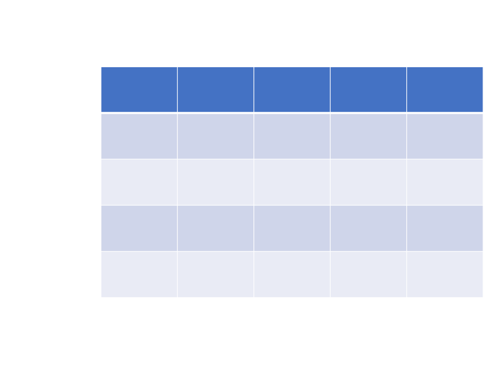
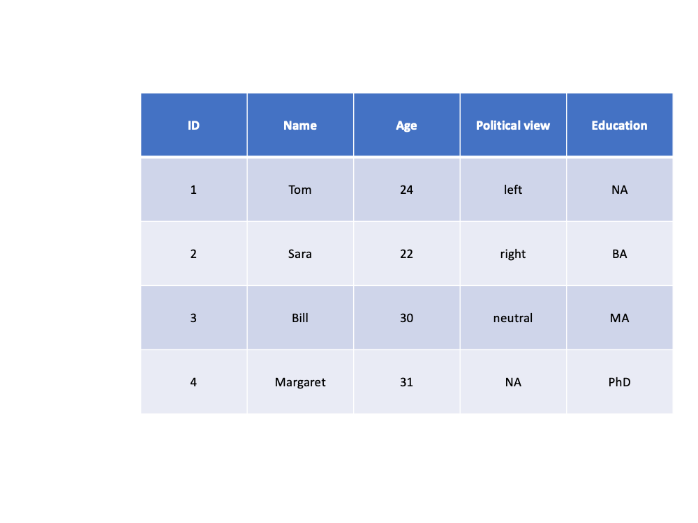
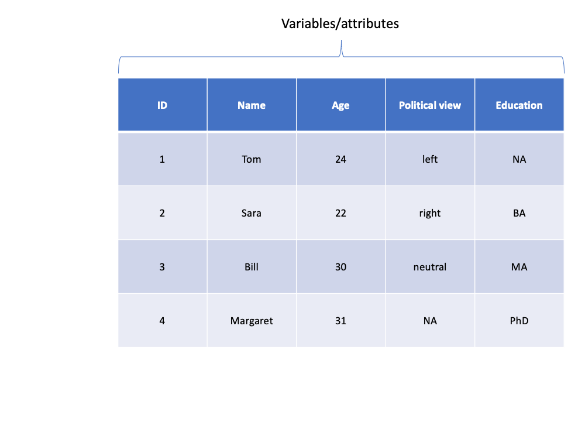
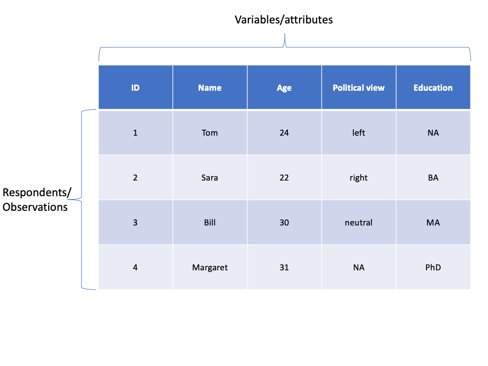
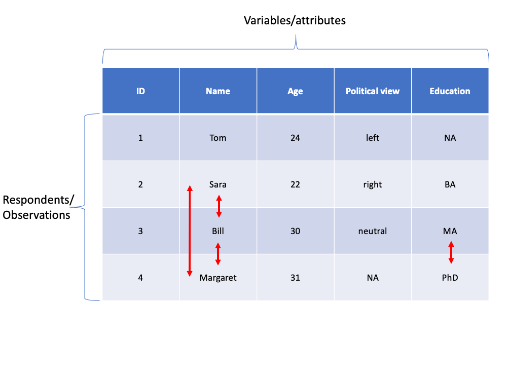
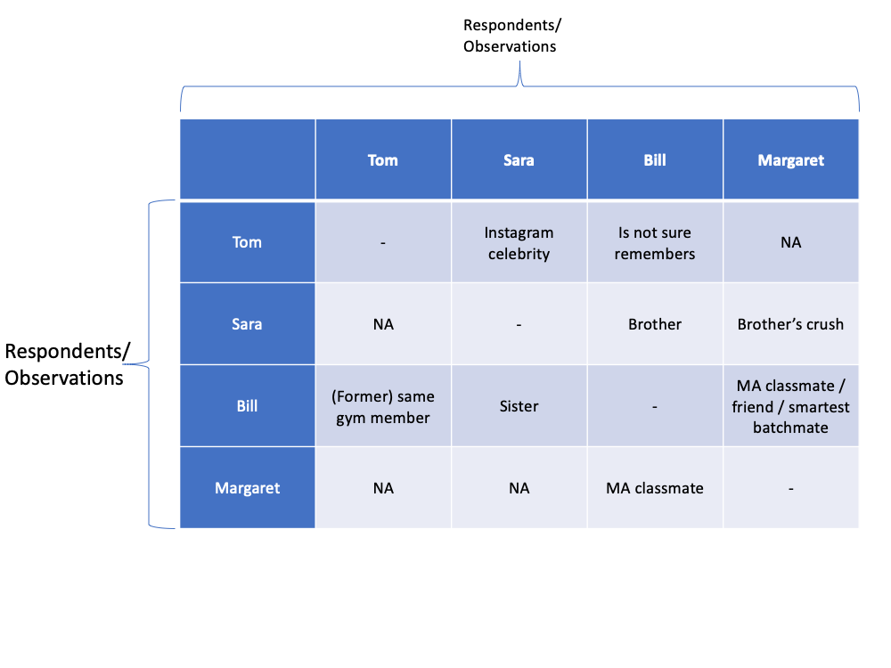
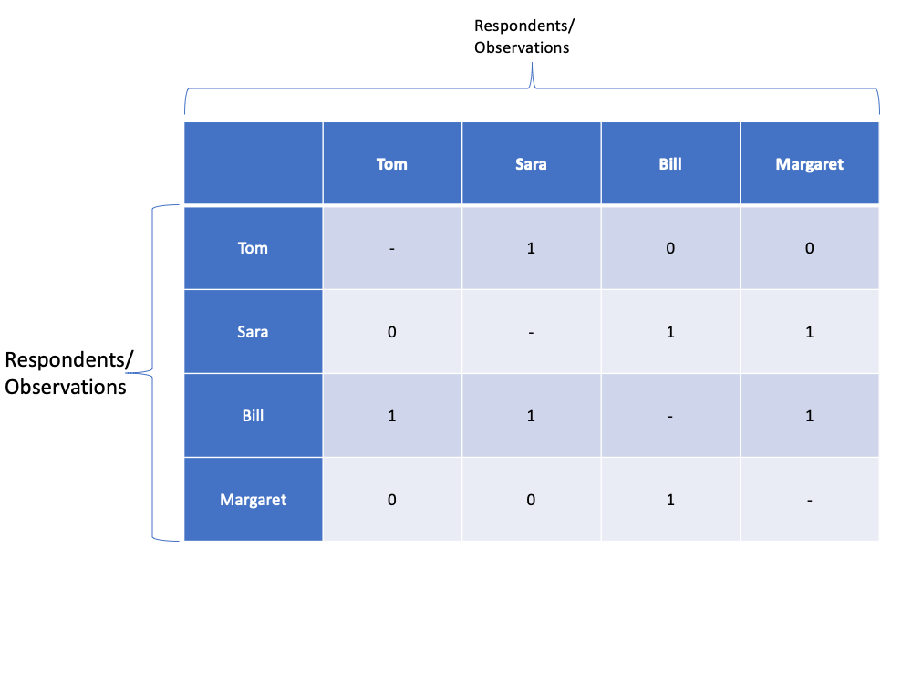
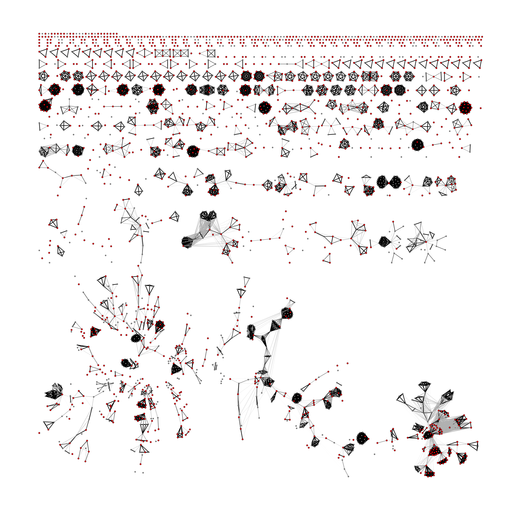
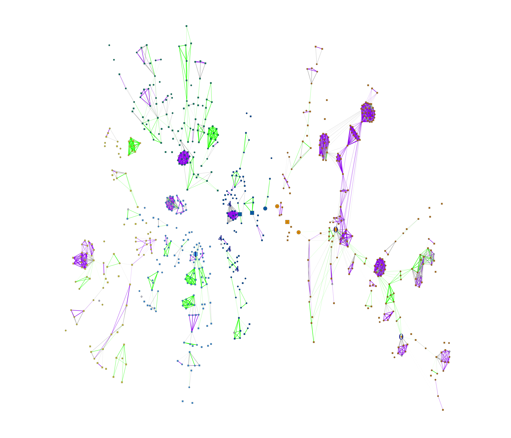
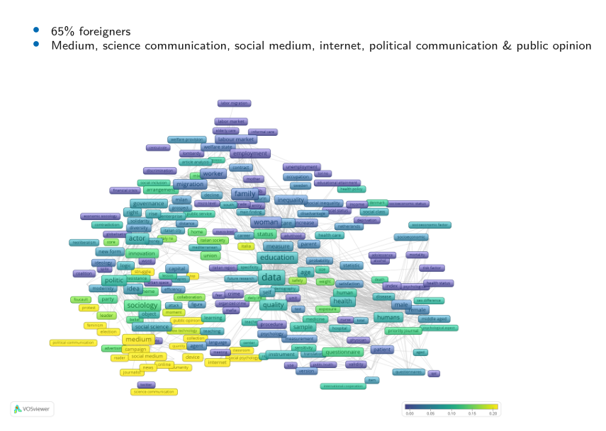

```{r setup, include=FALSE}
knitr::opts_chunk$set(
	echo = TRUE,
	message = FALSE,
	warning = FALSE,
	out.width='80%'
)
library(knitr)
library(tidyverse)
library(igraph)
```

## Outline of brief introduction to Network Analysis

>1. What is relational view and network analysis?
>1. Ethnography of network ties! Context of interactions
>1. How to gather and use network data?
>1. Possible questions to ask!
>1. A real life example from science studies!
>1. Where to next?!

## What is this?!
\tiny

```{r, echo=FALSE}

```

## Now what?!
\tiny
```{r, echo=FALSE}

```

## A poll/survey results?
\tiny
```{r, echo=FALSE}

```

## A variable by observation table
\tiny
```{r, echo=FALSE}

```

## What if respondents know each other?!
\tiny
```{r, echo=FALSE}

```

## Different contexts of familiarity 
\tiny
- Family, college, gym, ...
```{r, echo=FALSE}

```

## Stories behind ties!
\tiny
- Independence of observations? (in many cases it is violated!)
```{r, echo=FALSE}

```

## Adjacency (familiarity) matrix
\tiny
```{r, echo=FALSE}

```

## Read Edge List as CSV (to construct a network)
\tiny
```{r}
edge_list2_use <- read_csv("../1_data/humans_ties.csv")
kable(edge_list2_use)
```

## Convert it to a (network) graph object
\tiny
```{r}
gg = graph_from_data_frame(d = edge_list2_use, directed = TRUE)

print(gg)
```

## Plot the graph with a layout (directed)
\tiny
```{r}
set.seed(2225235)
gg_layout = layout.fruchterman.reingold(graph = gg)
plot(gg, layout = gg_layout, edge.label = NA, vertex.size=8)
```

## Plot the graph with a layout (un-directed)
\tiny
```{r}
gg_undirected = graph_from_data_frame(d = edge_list2_use, directed = F)
gg_undirected = simplify(graph = gg_undirected, remove.multiple = T)
plot(gg_undirected, layout = gg_layout, edge.label = NA, vertex.size=8)
```

## Add a new attribute to nodes?
\tiny
```{r}
print(V(gg))
V(gg)$gender <- c('male', 'female', 'male', 'female')
V(gg)$shape <- c('circle', 'square', 'circle', 'square')
print(gg)
```

## Color and shape of nodes based on gender
\tiny
```{r}
plot(gg, edge.label = NA, vertex.color = factor(V(gg)$gender), 
     vertex.shape = V(gg)$shape, layout = gg_layout, vertex.size=8)
```


## Name ties based on types
\tiny
```{r}
plot(gg, edge.label = E(gg)$label, layout = gg_layout, vertex.size=8)
```

## Weight ties based on importance
\tiny
```{r}
plot(gg, edge.width = E(gg)$weight*5, edge.label = E(gg)$weight, layout = gg_layout, vertex.size=8)
```

## Mixture of weight/label
\tiny
```{r}
plot(gg, edge.label = E(gg)$label, edge.width = E(gg)$weight*5, layout = gg_layout, vertex.size=8)
```

## A glimpse to more serious analysis
- After simple visualization (if possible), a five number summary!
    1. __Size__: _V_, _E_ (N of vertices/nodes and ties/edges, respectively)
    1. __Density__ (ratio of ties to possible ties, 1 = fully connected)
    1. __Components__ & (dis)connectivity (more connection inside groups, less among them)
    1. __Diameter__ (how compact the network is?)
    1. __Clustering Coefficient__ (transitivity and triangles)
- __Centrality__ in network (different measures of importance in structure)
    + Degree, Closeness, Betweenness, Eigenvector, ...

## In-degree of a node (incoming ties)
\tiny
```{r}
plot(gg, edge.label = NA, edge.width = E(gg)$weight*5, 
     vertex.label = degree(gg, mode = 'in'), layout = gg_layout, vertex.size=8)
```

## Out-degree of a node (outgoing ties)
\tiny
```{r}
plot(gg, edge.label = NA, edge.width = E(gg)$weight*5, 
     vertex.label = degree(gg, mode = 'out'), layout = gg_layout, vertex.size=8)
```

## Degree of a node (both incoming/outgoing ties)
\tiny
```{r}
plot(gg, edge.label = NA, edge.width = E(gg)$weight*5, 
     vertex.label = degree(gg, mode = 'all'), layout = gg_layout, vertex.size=8)
```

# A real life example from science studies!

## Sociological theories (& SNA conceptualization)[^citeref1]
- __Matteo effect__, winner takes all?
    + Highly prolific scientists attract higher collaborations from other
scientists?
    + Attaching preferably to a few __star scientists__/leaders?
- __Fragmentation__ of ideas, sociology as a interstitial science?
    + Methodologists bridging the islands?
- [Sociological] __small world__ of disconnected islands?
- __Core__ of leaders and __periphery__ of followers?

[^citeref1]: Akbaritabar, A., Traag, V. A., Caimo, A., & Squazzoni, F. (2020). Italian Sociologists: A Community of Disconnected Groups. Scientometrics. https://doi.org/10.1007/s11192-020-03555-w

## Coauthorship of Italian sociologists
```{r, fig.cap="", out.width='55%', echo=FALSE}

```

## Communities in the giant component
```{r, fig.cap="", out.width='65%', echo=FALSE}

```

## What can we learn from these communities? (1/2)[^citeref1]
```{r, fig.cap="", out.width='70%', echo=FALSE}
include_graphics("../99_images/what_to_learn_from_communities_1.PNG", dpi = 300)
```

## What can we learn from these communities? (2/2)[^citeref1]
```{r, fig.cap="", out.width='70%', echo=FALSE}

```


## Where to next?!
\tiny
- __Awesome network analysis__ list: https://github.com/briatte/awesome-network-analysis
```{r, fig.cap="", out.width='75%', echo=FALSE}
include_graphics("../99_images/Further_reading_materials.png")
```

# Best of luck in exploring networks!
