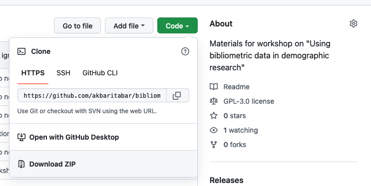

# Workshop on "Using bibliometric data in demographic research"

1. Workshop title: **Using bibliometric data in demographic research**

2. Organizers:
    - **Aliakbar Akbaritabar** (primary contact person, akbaritabar@demogr.mpg.de), Max Planck Institute for Demographic Research (MPIDR), GitHub: [https://github.com/akbaritabar](https://github.com/akbaritabar)
    - **Xinyi Zhao** (zhao@demogr.mpg.de), Max Planck Institute for Demographic Research (MPIDR), University of Oxford, GitHub: [https://github.com/zxy919781142](https://github.com/zxy919781142)

3.	Description of workshop objectives, goals, and expected outcomes. 
    - Overview of literature on using bibliometric data for demographic research and potential research projects and some of the newest bibliometric applications
    - Introduction to available data sources, especially publicly available data
    - Introduction to handling bibliometric data for demographic research: data retrieval, data pre-processing and repurposing based on research questions
    - Discussion about potential limitation and future directions of bibliometric data in demographic research

4.	Statement on how the workshop can benefit attendees. 
    - Familiarize themselves with the availability of bibliometric data as a type of digital data and its potentials for demographic research
    - Familiarize themselves with the most commonly used and available bibliometric databases
    - Learn about pre-processing steps and handling bibliometric data, including: 
        - Author/organisation name disambiguation 
        - Gender identification
        - Scholarly mobility and movement identification
        - Detecting missing countries, assigning scientific disciplines (to papers and at authors level based on publications in their career)
    - Learn about practical applications of bibliometric data in demographic research, including:
        - Use of some relevant scientometric indicators (N of publications, N of co-authors, citations, 3-year citations, FSS, (fractional scientific strength))
        - Calculation and use of demographic indicators (e.g., N and population of active scholars, stock and flows of scholars, academic birth, exiting academia (e.g., mortality and prospects of survival), academic kinship (mentorship ties and supervision, collaboration), Crude Migration Intensity, Migration Effectiveness Index and the Aggregate Net Migration Rate)
        - Network analysis of scientific collaborations
        - Text analysis of bibliometric information
5.	Structure of workshop (**3 hours 45 minutes**):
    1. Overview of literature on using bibliometric data for demographic research and potential research projects (**30 minutes**)
    2. Panel discussion (**90 minutes**) - invited speakers:
        - **Emilio Zagheni**, MPIDR: Benefits, strengths, weaknesses and pitfalls of using bibliometric data for demographic research
        - **Andrea Miranda-González**, UC-Berkeley: Internal migration in Mexico
        - **Asli Ebru Sanlitürk**, MPIDR: Brexit’s effect on scholarly migration to and from the UK
        - **Maciej J. Dańko**, MPIDR: Development and international scholarly migration
        - **Tom Theile**, MPIDR: Trends of return international migration worldwide
        - **Xinyi Zhao**, MPIDR: Gender perspective in international scholarly migration
        - **Aliakbar Akbaritabar**, MPIDR: Integrating internal and international scholarly migration worldwide
        - Followed by an open discussion between speakers and Q&A.

    3. Introduction to available data sources, especially publicly available data (**30 minutes**)
    4. Introduction to handling bibliometric data for demographic research: data retrieval, data pre-processing and repurposing based on research questions (**60 minutes**)
    5. Conclusion and discussion of potential limitations and future directions of using bibliometric data in demographic research (**15 minutes**)

6.	Description of target audience and estimated number of participants (minimum and maximum). 
    - Postgraduate students, early career researchers, those interested in high-skilled and scholarly mobility/migration and those interested in science of science, bibliometrics, scientometrics and informetrics.

7.	Proposed workshop duration (1/2 day, 1 day, 1.5 day, 2 day), format, activities, and schedule. 
    - 1/2 day. Lecture, dialogue and discussion with participants, hands-on session with data and software

8.	Short biographical sketches of presenters, link to current CVs. 
    - **Aliakbar AKBARITABAR** 
        - Research Scientist (Postdoc), Max Planck Institute for Demographic Research (MPIDR)
        - Background in Computational Social Sciences, Computational Sociology, Bibliometrics, Science of Science
        - Institutional profile page, projects and publications: https://www.demogr.mpg.de/en/about_us_6113/staff_directory_1899/aliakbar_akbaritabar_4098/
        - CV: https://www.demogr.mpg.de/files/cv/en/4098/Aliakbar_Akbaritabar_shortened_CV.pdf
        - GitHub: [https://github.com/akbaritabar](https://github.com/akbaritabar)
    - **Xinyi ZHAO**
        - PhD candidate, Max Planck Institute for Demographic Research (MPIDR), University of Oxford
        - Background in Geographical Information System, Demography, Sociology, Science of Science
        - Institutional profile page, projects and publications: https://www.demogr.mpg.de/en/about_us_6113/staff_directory_1899/xinyi_zhao_4083/ 
        - CV: https://www.demogr.mpg.de/files/cv/en/4083/CV_Xinyi%20Zhao_202204.pdf
        - GitHub: [https://github.com/zxy919781142](https://github.com/zxy919781142)

## Instructions for workshop participants

0. Please clone or download this repository ([https://github.com/akbaritabar/bibliometric_data_for_demographic_research](https://github.com/akbaritabar/bibliometric_data_for_demographic_research)) by clicking on the green button on top right (see photo)

1. Please go over the presentation files in the `2_presentations` directory, some are *self-study* materials that in combination with Python and R scripts in `0_code` directory should help you set-up and get started. You can ask your clarification questions by email or during the workshop Q&A sessions.
2. For `Python` users to replicate the results, you should follow steps outlined in `0_code\01_Required_installation_setup_python.md` to have all necessary libraries installed.
3. For `R` users to replicate the results, you should follow steps outlined in `0_code\02_Required_installation_setup_R.md` to have all necessary libraries installed.
